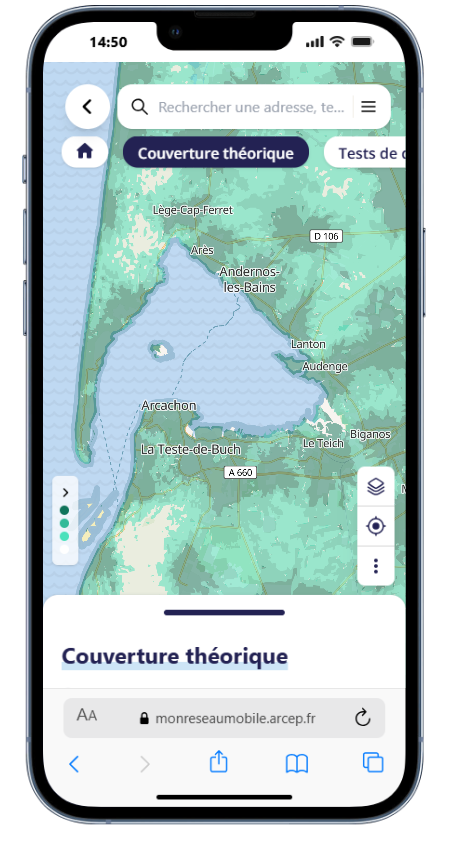
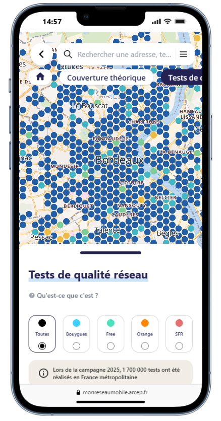
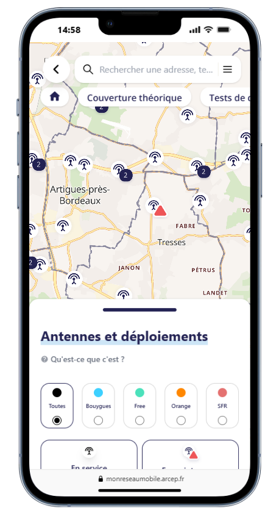
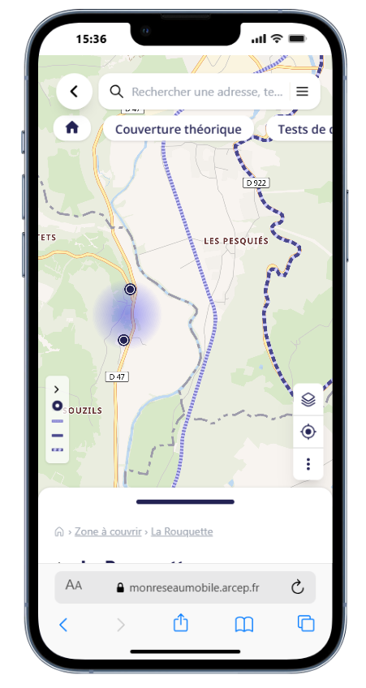
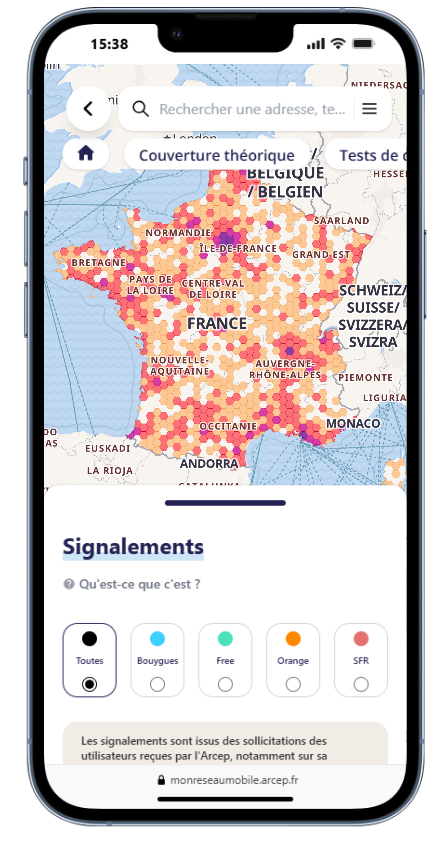
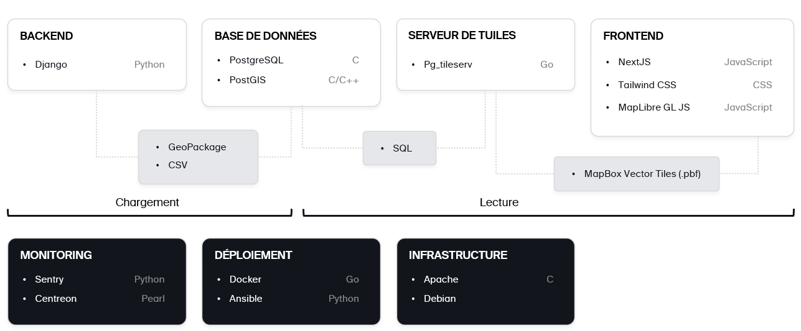

# Mon réseau mobile

**Comparer la couverture et la qualité de service des opérateurs mobiles en France**

[Accéder au service](https://monreseaumobile.arcep.fr/) ·
[Signaler un bug](../../issues) ·

---

## Sommaire

- [À propos](#-à-propos)
- [Fonctionnalités](#-fonctionnalités)
- [Captures et démonstration](#-captures-et-démonstration)
- [Sources de données](#-sources-de-données)
- [Architecture](#-architecture)
- [Pile technique](#-pile-technique)
- [Accessibilité et éco-conception](#-accessibilité-et-éco-conception)
- [Sécurité](#-sécurité)
- [Licences](#-licences)
- [Crédits et contact](#-crédits-et-contact)

---

## ℹ️ À propos

**« Mon réseau mobile »** est un outil cartographique édité par l'**Arcep** (Autorité de
régulation des communications électroniques, des postes et de la distribution de la presse).
Cette version correspond à la version disponible depuis **août 2025**. **« Mon réseau mobile »** 
permet de comparer les performances des  opérateurs mobiles en matière de couverture
(services : "Appels et SMS" et "Internet mobile") et de qualité de service dans son lieu de vie comme dans 
les transports, en France métropolitaine et en Outre-mer.

Le service s'adresse à tous les publics :

- les **particuliers** qui veulent comparer les réseaux avant de changer d'opérateur ;
- les **entreprises** qui envisagent une nouvelle implantation ;
- les **collectivités** qui suivent l'évolution des déploiements des réseaux mobiles sur leur territoire.

Ce dépôt publie le **code source** de l'application, conformément à la démarche d'ouverture
des codes sources des administrations (article L.300-4 du code des relations entre le public
et l'administration). Il vise la transparence, la réutilisation et la contribution de la communauté.

> ℹ️ Ce README décrit le projet à des fins de réutilisation. Le service de référence reste
> celui mis en ligne par l'Arcep : <https://monreseaumobile.arcep.fr/>.

---

## ✨ Fonctionnalités

L'application restitue, sur un fond cartographique interactif, plusieurs couches d'information
disponibles par opérateur et par technologie (2G / 3G / 4G) :

- **Cartes de couverture théoriques**
  - Couverture _Appels et SMS_
  - Couverture _Internet mobile_
- **Tests de qualité réseau** issus des campagnes de mesures terrain de l'Arcep et de partenaires
  - Tests de _navigation web_ 
  - Tests de _vidéo en ligne_ 
  - Tests de _débits descendants_ 
  - Tests de _téléversement de fichiers_ 
  - Tests de _voix_ 
  - Tests de _SMS_ 
- **Antennes et déploiements**
  - Emplacement des sites par opérateur.
  - Eplacement des sites en pannes.
- **Zones à couvrir** 
  - _Points d'intérêt_ (POI) et zones identifiées par les pouvoirs publics.
  - _Axes routiers prioritaires_ et _axes ferrés_.
- **Signalements** remontés via [« J'alerte l'Arcep »](https://www.arcep.fr/nos-sujets/jalerte-larcep-un-geste-citoyen-pour-ameliorer-les-reseaux-dechange.html).

> ⚠️ Les informations de couverture sont **simulées** et fournies à titre indicatif, sans valeur
> contractuelle. La couverture réelle peut varier selon le terminal, le bâti, la météo, la saison
> et la charge du réseau.

---

## 🖼️ Captures et démonstration

<table style="width:100%; table-layout:fixed">
  <tr>
    <th>Couverture mobile</th>
    <th>Qualité de service</th>
    <th>Antennes et déploiements</th>
    <th>Zones à couvrir</th>
    <th>Signalements</th>
  </tr>
  <tr>
    <td></td>
    <td></td>
    <td></td>
    <td></td>
    <td></td>
  </tr>
</table>

Accéder à l'application : **<https://monreseaumobile.arcep.fr/>**  
Démonstration de l'application : _à venir_

---

## 🗂️ Sources de données

Les données affichées proviennent de sources ouvertes et de transmissions réglementaires des
opérateurs. Les principales sources publiques réutilisables sont :

| Données | Producteur | Accès |
| --- | --- | --- |
| Cartes de couverture | Opérateurs / Arcep | [data.arcep.fr](https://data.arcep.fr/mobile/couvertures_theoriques/) |
| Mesures de qualité de service | Arcep | [data.arcep.fr](https://data.arcep.fr/mobile/mesures_qualite_arcep/) |
| Antennes et déploiements | Arcep / ANFR | [data.arcep.fr](https://data.arcep.fr/mobile/sites/) · [data.gouv](https://www.data.gouv.fr/datasets/donnees-sur-les-installations-radioelectriques-de-plus-de-5-watts-1) |
| Zones à couvrir | Arcep / Gouvernement | [data.arcep.fr](https://data.arcep.fr/mobile/dispositif_couverture_ciblee/) |
| Signalements consommateurs | Arcep (« J'alerte l'Arcep ») | Non disponibles |

Les jeux de données sont, sauf mention contraire, publiés sous **Licence Ouverte / Open Licence 1.0**
(Etalab). Vérifiez la licence propre à chaque jeu de données avant toute réutilisation.

---

## 🏗️ Architecture

## 🧰 Pile technique

---

- **Cartographie** : MapLibre GL JS, pg_tileserv, tuiles vectorielles.
- **Front-end** : Next.js, Tailwind.
- **Back-end** : Django.
- **Données géospatiales** : PostgreSQL + PostGIS.
- **Conteneurisation & déploiement** : Docker, Ansible.

---

## ♿ Accessibilité et éco-conception

Service public numérique, l'application vise la conformité au [RGAA](https://accessibilite.numerique.gouv.fr/) (Référentiel général
d'amélioration de l'accessibilité) et au [RGESN](https://ecoresponsable.numerique.gouv.fr/publications/referentiel-general-ecoconception/) (Référentiel général d'écoconception de services numériques). 
Toute contribution doit veiller à ne pas dégrader l'accessibilité (navigation clavier, contrastes, alternatives
textuelles, ARIA) ni la sobriété (poids des assets, requêtes réseau).

---

## 🔐 Sécurité

Merci de **ne pas** divulguer publiquement une faille de sécurité dans une issue.
Signalez-la de manière responsable via l'adresse de contact ci-dessous. 

Adresse de contact : consommateurs@arcep.fr

**Mon reseau mobile** fait l'objet d'audit de sécurité réguliers et s'inscrit dans la 
démarche de sécurisation des systèmes d'informations proposée par l'ANSSI (Agence nationale 
de la sécurité des systèmes d'information) via [MonServiceSécurisé](https://monservicesecurise.cyber.gouv.fr/).
Néanmoins, des failles peuvent subsister. 

---

## 📜 Licences

- **Code source** : publié sous **GNU GPL-3.0**. Voir [`LICENSE`](LICENSE).
- **Données** : **Licence Ouverte / Open Licence 1.0** (Etalab), sauf mention contraire propre
  à chaque jeu de données.
- **Marques et logos** (« Mon réseau mobile », Arcep) : protégés, exclus de la licence du code
  et non réutilisables sans autorisation.

---

## 🙏 Crédits et contact

- **Éditeur** : Neogeo Technologies, BAL, 67 All. Jean Jaurès, 31000 Toulouse.
- **Données partenaires** : Collectivités territoriales, Speedchecker, Ookla (liste non-exhaustive)
- **Service en ligne** : <https://monreseaumobile.arcep.fr/>
- **Page d'information** :
  [Comment utiliser « Mon réseau mobile » ?](https://www.arcep.fr/mes-demarches-et-services/consommateurs/fiches-pratiques/comment-utiliser-mon-reseau-mobile.html)
- **Contact** : <https://www.arcep.fr/nous-contacter.html>

—

*« Mon réseau mobile » — un service de l'Arcep.*

